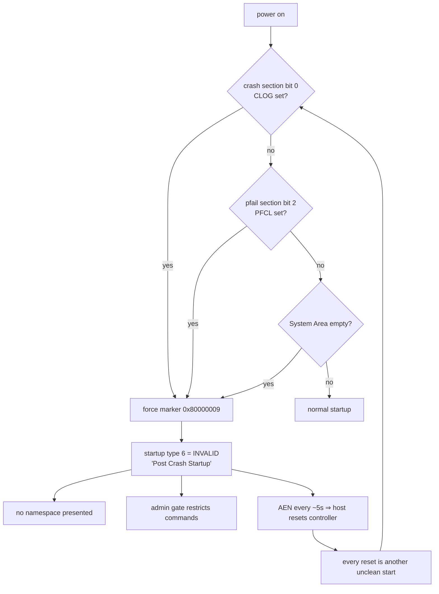
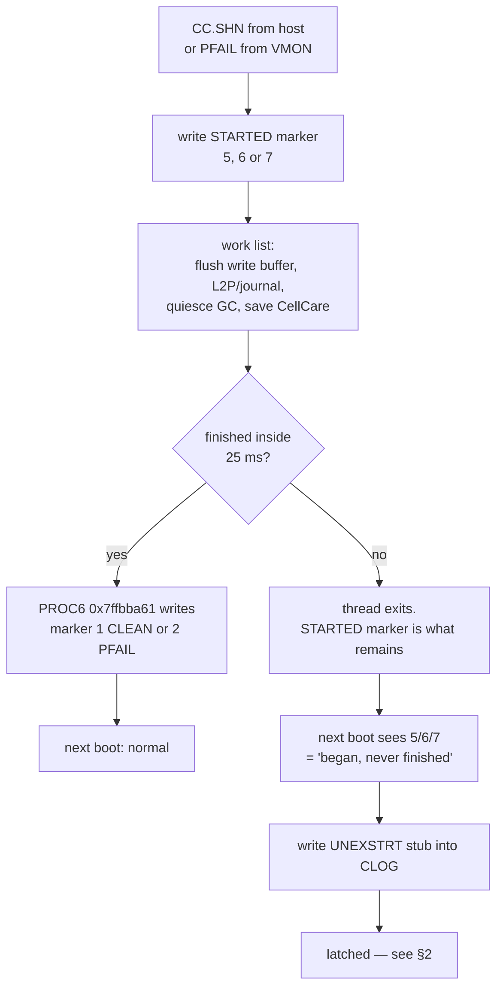
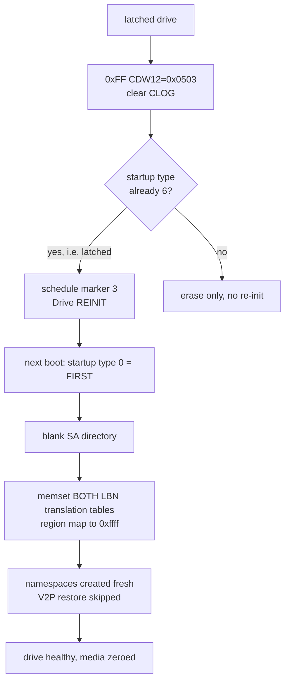
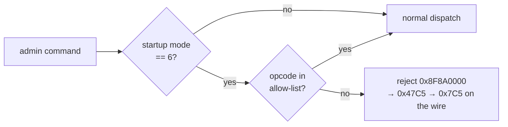
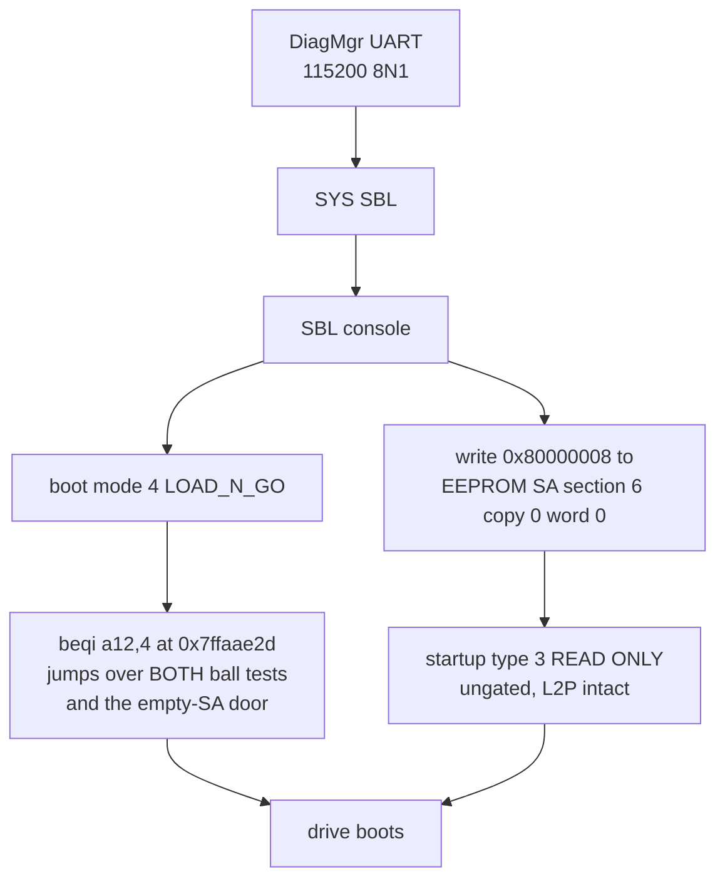

# SN200 firmware: how it actually works

How the HGST/WDC Ultrastar SN200 (`HUSMR7676BDP3Y1`, firmware `KNGND122`)
boots, shuts down, latches, and refuses to come back — as a single narrative.

The detail lives in sibling docs; this is the map that makes them navigable:

| Doc | Covers |
|---|---|
| `sn200-memory-map.md` | what is core-local vs shared, and why isolation holds |
| `sn200-xtensa-isa.md` | instruction encodings, FLIX slots, decoder corrections |
| `sn200-command-reference.md` | every command, encoding, gating, safety class |
| `sn200-firmware-re.md` / `sn200-independent-re.md` | the two independent teardowns |
| `sn200-shutdown-path.md` | why the shutdown fails to finish |
| `sn200-readonly-startup.md` | marker 8, and why nothing writes it |
| `sn200-logic-escapes.md` | the one route out (UART) |
| `sn200-dangerous-commands.md` | commands that destroy a drive |
| `sn200-field-evidence.md` | what was actually observed on hardware |
| `sn200-bmc-mitigation.md` | who drives PROC9's NVMe-MI, the live iDRAC knobs, and the measurement that would settle it |
| `sn200-vuc-flash-read.md` | the read-by-LBA VUC, and why the latch gates it off |
| `sn200-oam-dispatch.md` | the complete `0xFF` table; which of `0x0503`/`0x0603` wipes |
| `sn200-c6-dispatch.md` | the complete `0xC6` table; the other family that survives the gate |
| `sn200-ca-dispatch.md` | the complete `0xCA` table, **executed**; the two commands that destroy a drive, and the mechanical adjacency map |
| `sn200-c6-30-family.md` | `0xC6`/`0x30` fully traced — SMART/statistics collection, no escape; corrects the `CDW10 == 0` claim |
| `sn200-section-arming.md` | what arms CLOG and PFCL, and why `0x0603` can never help |
| `sn200-marker-write.md` | the generic marker-write (verb 1 + section 6), why no host command reaches it, and what a serial-console primitive would actually be worth |
| `sn200-nondestructive-clear.md` | the exhaustive enumeration of EEPROM-request producers (only `0x0503` reaches verb 3 + section 11), why the mode-6 gate cannot be dodged, and the reframe: the re-init is a 4-byte record value, not an action |
| `sn200-pcode-toolchain.md` | lifting the firmware to p-code and **executing** it — the claims above as tests, and what the lifter cannot read |
| `sn200-tie-opcodes.md` | the custom/reserved instruction space: what is really undecodable, why it is not what we thought, and how `0xFF`/`0x0303` was finally resolved |
| `sn200-vendor-tooling.md` | vendor names for these opcodes from `nvme-cli`'s WDC plugin — what is confirmed, and the three numeric collisions that must **not** be adopted |

Everything below is PROVEN from code unless marked otherwise.

---

## 1. The machine

Not one CPU. **18 Tensilica Xtensa images**, each its own core with its **own
address space** — which matters more than it sounds: a memory-write primitive on
one core cannot reach another's state. That single fact closed most of the
offensive avenues, and it is **PROVEN** — `0x7ff80000` is a self-aliased 512 KiB
slot of the SoC unit grid, not a shared window (`sn200-memory-map.md`).

| Image | Role |
|---|---|
| `PROC0` | system manager, boot/startup, PFAIL ISR, crash sections, `DiagMgr>` UART |
| `PROC6` | System Area save — writes the CLEAN/PFAIL "finished" marker |
| `PROC8` | admin command dispatch, gates, namespace startup, firmware update |
| `PROC9` | PCIe, NVMe-MI/MCTP, RSA public keys |
| `PROC12` | NAND event log |
| `PROC1-5,7,10,11,13-15` | data path — write buffer, V2P, GC, NAND scheduling |
| `FCC` | uses the **call0 ABI**, not windowed — no `entry` prologues at all |

Code is delivered as `.BIN` containers of `.SEG` segments. `PROC8` additionally
has an **overlay bank**: linked at `0x300xxxxx`, executed from `0x7ffbc000`, so
`static = ddr_src + (runtime − 0x7ffbc000)`. Some overlay pages are not in the
dump at all, which is why ~99% of that bank's call targets are unresolvable.

---

## 2. The one predicate that ruins everything

At boot, PROC0 runs two tests — one per crash section — and **either one** forces
the same outcome:

Sites: `0x7ffaae35` and `0x7ffaae3d` both branch to `0x7ffaaf08`, which writes
`0x80000009`. Bit mapping proven three ways (TOC `0x7ff84a70`, producer
`0x7ffb461c`, consumer `0x7ffab010`): **bit 0 ⇒ section `0x0b` CLOG**, **bit 2 ⇒
section `0x0a` PFCL**. Flags byte at `0x7ff8d200`.

**The loop is self-sustaining.** The AEN makes Linux reset the controller every
~5 s; each reset is itself an unclean start; each unclean start re-arms the
section. The host is helping hold the drive down.

**Startup type 6 is literally named `INVALID`.** `NORMAL` is 1. That naming
matters — see §6.

---

## 3. Shutdown: markers are breadcrumbs, not verdicts

The most-misread part of this firmware. A shutdown writes **"STARTED" first**,
then runs a work list, and only *afterwards* writes "FINISHED".

So markers **5** `Normal Shutdown STARTED`, **6** `PFAIL Shutdown STARTED` and
**7** `PFAIL Shutdown TIMEOUT` are not error codes. They are the opening
breadcrumb, left behind when the rails collapse mid-list.

**The budget is 25 ms** — `0x7ff830e0 = 25000`, scaled by cycles-per-µs against
CCOUNT, units pinned by `SYS: PFAIL time = %5u.%03u ms`. At expiry the supervisor
does **not** force completion: it writes marker 7 and **exits**. It is a
stopwatch that labels the failure, not a hold-up guarantee.

### Why the list doesn't finish — three defects, one of them decisive

1. **No admission control.** The work simply exceeds the hold-up window. (Note
   this is *not* the 25 ms timer — see the workload caveat below.)
2. **The lost-PFAIL race.** `PCIe_PfailShutdown` finds the port already claimed
   by link-down's bottom half and logs *"already shut down or in the process of
   shutting down - Do nothing"*. This is WD's documented race — and it is **not**
   interrupt masking: PFAIL is PROC0-only, so PROC9 only ever sees a message.
3. **The GC deadlock — PROVEN, and it has no escape on a normal shutdown.**
   Both halves live in PROC11. The waiter `0x7ffa8070` blocks on three counters
   — `0x7ff80fd4` (page relocations), `0x7ff810d0` (reclaim reads), `0x7ff810d8`
   (pending V2P) — each with **only** a `mode == 5` escape, no timeout and no
   bail-out. It is a continuation task, so it parks rather than spins; one timer
   is armed on first entry and **no resume path ever reads it**.

   Meanwhile a normal `CC.SHN` shutdown sets mode **4**. All 24 mode tests in
   PROC11 compare against 5 (one against 2) — **none against 4**. So while the
   waiter waits, the producers keep incrementing those same counters and the
   dispatcher still accepts *new* page-relocation requests. **The set of tasks
   that can satisfy the wait is the set that can defeat it.**

   Mode 5 is written at exactly one site, `0x7ffa2bc5`, reachable only when the
   shutdown message carries state 3 — i.e. from *outside* GC, and in that case a
   different task runs anyway. **A normal `CC.SHN` with no PFail therefore has
   no escape at all.** The PFail variant is worse still: it waits with no mode
   test, no timer and no bail-out, directly on the hold-up window.

   This matters because it is a path to an unfinished shutdown that needs **no
   power event whatsoever** — which is the shape of the field case where a
   `mkfs.xfs` latched a healthy, running drive.

Plus two *unconditional* silent exits where the monitor logs "PFAIL is detected",
exits, and initiates no shutdown and no marker at all.

> **A third defect was claimed here and is WITHDRAWN.** "The System Manager
> re-arms PFAIL monitoring mid-shutdown, anchoring the deadline to the latest
> PFAIL edge" does not survive checking. The word the branch tests,
> `[0x7ff8c7ec]`, is **not** a SAM handshake — it is PROC0's boot info block,
> whose marker field is written only by boot-side code. The branch also sits
> *after* `SYS: Returning shutdown completion` and is unreachable while PFAIL is
> asserted, because `0x7ffa8d25` diverts to the power-off watcher first. What it
> actually schedules is *"Waiting for CC.EN (FAST_RESTART) from PcieMgr"*, where
> re-enabling PFAIL monitoring is correct behaviour. See
> `sn200-shutdown-path.md` §4.

**There is a second, admin-side PFAIL monitor** — PROC8
`Admin_ShutdownPFailMonitor` at `0x7ffb1b60`. It is **polled** rather than
interrupt-driven, spawned once per admin shutdown (including normal `CC.SHN`),
one-shot, and has **no timeout at all**. On detecting PFAIL it flips the global
shutdown mode 2 → 3 and terminates itself. It shares no state with PROC0's
monitor, so the two do **not** race — and being a poll, it is an accidental
backstop for the lost-interrupt defect above. Its poll loop is provably
unbounded while `[0x7ff95678] != 0`, and no incrementer for that word exists in
either PROC8 image; whether it is ever entered non-zero is INFERRED.

**Exposure scales with workload — INFERRED, and the original argument for it was
wrong.** The claim was "fixed 25 ms budget against live counters, therefore a
busy drive latches". Red-teaming killed the *because*: **the 25 ms enforces
nothing.** At expiry the monitor submits marker 7 and exits, and nothing
downstream reads the deadline — so if the work takes 40 ms and the rails hold
50 ms, PROC6 still writes `0x80000002` over the breadcrumb and the drive boots
clean. Exceeding 25 ms is by itself harmless.

The real constraint is **hold-up energy**, which appears nowhere in the firmware
and has never been measured on these drives. Workload scaling may well be true —
more dirty state means a longer save means a greater chance of running out of
hold-up — but it rests on an unmeasured physical quantity, not on the timer.
Treat it as a plausible model, not a proven one.

**`CC.SHN` is necessary but not sufficient.** The NVMe shutdown path writes only
marker 5; CLEAN comes from a *different* routine after the flush completes. An
acknowledged shutdown whose flush doesn't finish latches exactly like a power cut.

---

## 4. Recovery, and why it costs the data

The gate is `bnei a14,6`: **`0x0503` schedules the wipe only when the drive is
already latched.** Fired from a normally-booted drive it erases the section
harmlessly — which is circular and therefore useless, since a set bit forces the
latch which forces mode 6.

`0x0603` (PFCL) is synchronous and schedules nothing — now PROVEN at the
instruction level: its resume handler has no `bnei a14,6` and no second request
post, so it can never blank the L2P. But `UNEXSTRT` stamps **CLOG**, so it
cannot release a power-event latch either. It looked as though it could release
a **PFCL-only** latch with the data intact — but that branch is **withdrawn**:
the boot that latches on PFCL writes marker 9 and falls straight into the
`UNEXSTRT` stub writer (`0x7ffaad01`), which stamps CLOG on that same boot. The
precondition cannot be observed. See `sn200-section-arming.md`.

The whole `0xFF` surface is now enumerated — three command ids (`0x03`, `0x04`,
`0x07`), nine valid `CDW12` encodings, nothing else — and it contains **no**
boot-mode write, **no** marker write other than re-init, and **no** namespace
attach. The escape is not hiding there.

**Firmware activation is not a safe alternative.** Marker 3 is written gated on
**bit 0 of the target image's own flags word**, so whether an activation wipes is
a property of the image in that slot, not of the commit action. `--action=2` is
not a pointer flip. Its only genuine advantage is using no vendor opcodes.

---

## 5. The admin gate

`PROC8 0x7ffa6b18` hosts **four** gates — Post-Crash, VUC Control, sanitize, and
one more. That is why two independent teardowns disagreed for hours: each was
reading a different gate.

Post-Crash gate (`0x7ffa6b30`–`0x7ffa6bd8`) is an **allow-list**:
`0x00 0x01 0x02 0x04 0x05 0x06 0x08 0x09 0x0A 0x0C 0x10 0x11 0xE6 0xEC 0xFF`,
plus `0xC6` when `a4 ∈ {0x20,0x30}`, plus `0xCA` with a 12-entry sub-list.

Two consequences:

- **Firmware Download and Commit are permitted while latched** — which is why
  slot-filling and activation work on a dead-looking drive.
- **So are raw NAND erase (`0xCA` `0x0F`) and raw page write (`0xCA` `0x10`).**
  A latched drive will destroy itself on one well-formed command. See
  `sn200-dangerous-commands.md`.

---

## 6. Why there is no software way out

Four independent walls, each proven separately:

| Wall | Evidence |
|---|---|
| **Firmware images are signed** | RSA-2048 over SHA-256; three public keys compiled into PROC9. `SECURITY.bin` is a *copy of the key blob*, not a signature — which is why it is revision-invariant |
| **The mode word is unwritable** | `0x7ff87c64` has two writers, both on an inter-processor message path with zero callers from any NVMe command |
| **No memory-safety bug** | 16/17 allow-listed opcodes audited clean — and both targets worth writing are in *other cores' address spaces* anyway |
| **Marker 8 has no writer** | the sole marker setter emits only 3 and 4 |

Marker **8 `READ ONLY`** is the tantalising one. It is *not* a degraded mode: SAM
sets one flag bit and falls into the **normal** boot path — L2P restored,
namespace present, writes refused at the admin/IO layer. Exactly what you'd want
to rescue data. And because the gate is a bare `bnei a8,6`, startup type 3
**sails straight through it**.

But no firmware code writes it. The marker is **persistent state** — word 0 of a
244-byte record in EEPROM System-Area section 6, two redundant copies, the
dispatcher healing the primary from the secondary.

### The one route out (INFERRED where noted)

Every firmware link is proven; **only the UART pinout is unknown** — PROC0 has no
UART MMIO or pinmux, so the firmware cannot tell you the pins.

In that console: never type `I2CErase` (destroys FRU/VPD) or `LogicTrap`
(deliberate crash), and set exact name matching — under flexible matching a bare
`S` resolves to `SBL`.

---

## 7. What this means operationally

- **A latched drive still has its media.** The metadata is destroyed only by the
  re-init, and that is *our* action, not the fault. A drive left powered down
  keeps every option open.
- **Prevention beats recovery, but is not absolute.** Orderly shutdowns collapse
  the dominant term (workload scaling) but defects 2 and 3 and both silent exits
  sit on the shared path, and `CC.SHN` is downgraded to a PFAIL shutdown if the
  rails sag mid-run. Best lever order: stop deallocates/TRIM → `sync` + unmount →
  `CC.SHN` and **wait** → only then cut power.
- **`KNGND122` is terminal.** Nothing newer exists anywhere, and it was still
  fixing this defect family when it shipped. WD marks the family
  *"unable to recover"*.
- **A latched drive is harmless to its host** provided nothing targets it — 21
  controller resets were logged while `udevd` and `kubelet` stayed healthy. It
  only wedged the node when a volume manager tried to partition it.
