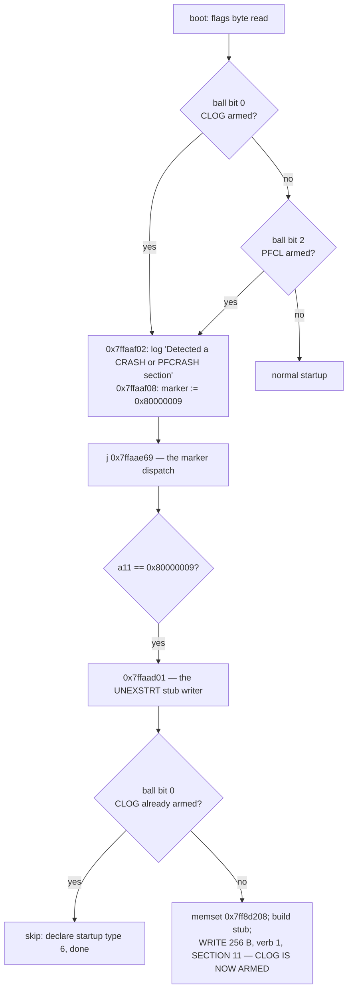

# What arms CLOG and PFCL — and why the `0x0603` branch is unreachable

Scope: the two crash sections that force the Post-Crash latch — EEPROM section
**`0x0b` (11) "Crash Dump" = CLOG = flags bit 0** and **section `0x0a` (10)
"PFail Crash Dump" = PFCL = flags bit 2**. The boot predicate is an **OR** of
the two (`sn200-firmware-flow.md` §2), so a data-preserving recovery exists in
principle: `0xFF/0x0603` erases PFCL and provably schedules nothing
(`sn200-oam-dispatch.md` §4.2). This document establishes how often that branch
can actually apply.

**Answer: essentially never, and the reason is a single instruction.** The boot
that latches on PFCL falls straight into the `UNEXSTRT` stub writer and stamps
**CLOG** before it finishes. By the time an operator can observe a latched
drive, both sections are armed.

Labels: **PROVEN** = read off correctly-decoded instructions. **INFERRED** =
short chain over proven facts. **SPECULATIVE** = neither.

---

## 1. The EEPROM section API, and how to read a section id off a call site

All System-Area section traffic in PROC0 goes through one submitter,
**`0x7ffb4fec`** (33 call sites). Its arguments, read off the stores that
precede every call:

| reg | field |
|---|---|
| `a10` | request object |
| `a11` | **verb** — `0` status/probe, `1` write, `2` read, `3` erase |
| `a12` | **section id** |
| `[a10+0x20]` | flags byte | 
| `[a10+0x24]` | buffer |
| `[a10+0x28]` | length |

PROVEN by interlock: the same verb/section pair appears in the OAM erase family
(`sn200-oam-dispatch.md` §4.1 — verb `3`, sections `11`/`10` for `0x0503`/
`0x0603`) and in PROC0's own erase arms at `0x7ffa398b` (`movi a11,3;
movi a12,10`) and `0x7ffa3a30` (`movi a11,3; movi a12,11`). Two independently
written code paths, same encoding.

Sweeping all 33 call sites for a section constant of `10` or `11`:

| site | verb | section | what |
|---|---|---|---|
| `0x7ffa398b` | 3 erase | **10** PFCL | SA manager erase arm |
| `0x7ffa3a30` | 3 erase | **11** CLOG | SA manager erase arm |
| `0x7ffab1e1` | 0 probe | **10** PFCL | boot section-state evaluator |
| `0x7ffab1fc` | 0 probe | **11** CLOG | boot section-state evaluator |
| `0x7ffab227` | 2 read | **10** PFCL | evaluator, header read |
| `0x7ffab24a` | 2 read | **11** CLOG | evaluator, header read |
| **`0x7ffaaf13`** | **1 write** | **11** CLOG | **the `UNEXSTRT` stub writer** |

**There is exactly one `verb == 1` (write) call against either section in all of
PROC0, and its section is 11 (CLOG). PROVEN.**

---

## 2. The flags byte, and what the boot predicate actually tests

`0x7ff8d200`, byte 0. Bit layout, recovered from the evaluator `0x7ffab010`,
which is the only producer:

| bit | meaning |
|---|---|
| 0 | CLOG (section 11) **armed** |
| 1 | CLOG evaluated |
| 2 | PFCL (section 10) **armed** |
| 3 | PFCL evaluated |

Polarity is PROVEN semantically at two sites where the branch and the log string
sit next to each other, and it is already encoded in `tools/sn200-fw/xdis.py`'s
`BR_MASK` comment:

```asm
7ffab265: l8ui a8,a5,0x0                       ; a5 = 0x7ff8d200
7ffab268: ball a8,mask 0x1,0x7ffab1b3           ; bit 0 SET -> go read section 11
7ffab270: { movi a11,1277 ; j 0x7ffab0d0 }      ; bit 0 CLEAR -> StrId 1277
                                                ;   "SYS: Crash Dump section is erased"

7ffab0d9: ball a14,mask 0x4,0x7ffab16b          ; bit 2 SET -> go read section 10
7ffab0e1: movi a11,1280                         ; bit 2 CLEAR -> StrId 1280
                                                ;   "SYS: PFail Crash Dump section is erased"
```

The boot predicate reads the same byte and uses the same two masks:

```asm
7ffaae2d: { l8ui a9,a5,0x0 ; beqi a12,4,0x7ffaae53 }   ; boot mode 4 skips both tests
7ffaae35: ball a9,mask 0x1,0x7ffaaf02                  ; CLOG armed
7ffaae3d: ball a9,mask 0x4,0x7ffaaf02                  ; PFCL armed
7ffaaf02: l32r a10,-> StrId 3042 "SYS: Detected a CRASH or PFCRASH section."
7ffaaf08: l32r a11,-> 0x80000009 ; s32i a11,a7,0x0 ; j 0x7ffaae69
```

Note `beqi a12,4` at `0x7ffaae2d`: **boot mode 4 (`LOAD_N_GO`) jumps over both
tests**, which is the UART escape already documented in
`sn200-firmware-flow.md` §6.

> **One unresolved detail, flagged rather than papered over.** In the boot
> coroutine `0x7ffaac30`, `a5` is loaded at entry with `0x7ff8b4f8` (the shared
> EEPROM *request object*, polled as `[a5+8]`), and the stub writer at
> `0x7ffaad01` uses `a5` as the *staging buffer* base (`[a5+0x8]` = CDH magic,
> `[a5+0x48]` = `"UNEXSTRT"`), which must be `0x7ff8d200` because the write at
> `0x7ffaaf13` passes buffer `0x7ff8d208` and the preceding `memset` clears
> `0x7ff8d208`. So `a5` is reassigned somewhere on that path, inside a FLIX
> region this repo's decoder does not fully resolve. **The reassignment site is
> not identified.** Every conclusion below survives either way: the boot
> predicate, the stub gate and the stub writer all read *the same* `a5+0`, so
> the gate and the predicate are testing the same bit whichever byte it is.

---

## 3. (a) Every writer of each section

### CLOG (section 11) — two writers, both PROVEN to exist

**Writer 1 — the `UNEXSTRT` stub, PROC0 `0x7ffaad01`.** This is the one that
matters, and it has never been read at the instruction level before:

```asm
7ffaad01: l8ui a14,a5,0x0
7ffaad04: ball a14,mask 0x1,0x7ffaac82        ; <-- CLOG ALREADY ARMED? then do nothing
7ffaad0c: { l32r a10,-> 0x7ff8d208 ; movi a12,256 ; movi a11,0 }
7ffaad14: call8 0x7ffb54b4                    ; memset(0x7ff8d208, 0, 256)
7ffaad17: l32r a9,-> 0x00020100               ; container version = STUB
7ffaad1a: l32r a8,-> 0x48444300               ; "\0CDH"
7ffaad1d: s32i.n a8,a5,0x8                    ; +0x00 in file: magic
7ffaad1f: s32i.n a9,a5,0xc                    ; +0x04 in file: version
7ffaad21: rsr a12,234                         ; CCOUNT
7ffaad43: s32i.n a12,a5,0x18                  ; +0x10 in file: timestamp
7ffaad41: s32i.n a11,a5,0x1c                  ; +0x14 in file: fault counter
7ffaad45: l32r a14,-> 0x53545254  "TRTS"
7ffaad48: l32r a15,-> 0x554e4558  "XENU"
7ffaad4b: s32i a15,a5,0x48                    ; +0x40 in file: "UNEX"
7ffaad4e: s32i a14,a5,0x4c                    ;               "STRT"
...
7ffaaf13: { l32r a11,-> 0x7ff8d208 ; movi a12,0 }
7ffaaf23: s32i a11,a10,0x24                   ; buffer  = 0x7ff8d208
7ffaaf2b: { s32i a9,a10,0x28 ; movi a11,1 ; movi a12,11 }   ; len 256, VERB 1, SECTION 11
7ffaaf33: call8 0x7ffb4fec                    ; WRITE
```

The struct offsets are a hard interlock with the retrieved dump: struct `+0x08`
↔ file `+0x00`, `+0x18` ↔ `+0x10`, `+0x48` ↔ `+0x40` — exactly the layout
`sn200-fault-record.md` §2 read off `nvme7`. PROVEN.

Reached from **two** places, both in the startup-marker dispatch:

| marker | route |
|---|---|
| **5 / 6 / 7** (`Normal Shutdown STARTED`, `PFAIL Shutdown STARTED`, `PFAIL Shutdown TIMEOUT`) | `0x7ffaaf6b` → boot mode ≠ 4 → `0x7ffaacea` (logs StrId 1271/1272 from the table at `0x7ff81180`) → falls through into `0x7ffaad01` |
| **9** (`Post Crash`) | `0x7ffaaec8: beq a11,0x80000009 → 0x7ffaad01` |

**Writer 2 — the full fault dump.** Container version `0x00020200`, reason tag
zero, written by the exception path (PROC0 `0x7ffa29bd` and the per-core
appenders; `sn200-fault-record.md` §1). This is what `nvme7` actually holds.
Its section-select site was not located in this pass — the crash sections are
also visible to PROC8 as an SPI region behind `*(0x82a60008)` bits 6/7, and the
dump writer plausibly uses that path rather than the EEPROM section API.
**INFERRED**, and it does not change any conclusion: it is a CLOG writer either
way (the retrieved `nvme7` dump was read with `CDW12 = 0x0420`, the crash
section).

### PFCL (section 10) — no writer found in PROC0

Exhaustive over the section API: **no `verb == 1` call against section 10 exists
in PROC0.** PROVEN for that API. The section is only ever *probed* (`0x7ffab1e1`),
*read* (`0x7ffab227`) and *erased* (`0x7ffa398b`, and `0xFF/0x0603`).

So PFCL is written by the same dump machinery as writer 2, selecting section 10
instead of 11 when the dump is taken during a PFAIL event — which is exactly
what its name (StrId 1224 `PFail Crash Dump`) and its parallel state trichotomy
(StrIds 1280–1282) say. **INFERRED.** Nothing in this pass contradicts it and
nothing proves it.

---

## 4. (b) Is there a field scenario that arms PFCL alone? — the crux

**Arming PFCL alone is possible. *Observing* it is not.**

The argument is one control-flow edge:



Every edge is PROVEN: `0x7ffaaf08` writes `0x80000009` into `[a7+0]` and jumps
to `0x7ffaae69`, which is the head of the marker comparison chain; that chain
tests `a11` — the value just written — and `0x7ffaaec8` sends `0x80000009` to
`0x7ffaad01`.

Consequences:

1. **A PFCL-only latch arms CLOG on the very boot that latches.** The drive
   detects PFCL, forces marker 9, and immediately stamps an `UNEXSTRT` stub into
   the section `0x0603` cannot touch.
2. **The reset loop closes the window.** The AEN drives a controller reset every
   ~5 s and each reset re-runs this path, so even if the stub write lost a race
   on the first boot it lands on the next one.
3. **The previous belief was right for the wrong reason.** The old claim —
   *"`UNEXSTRT` stamps CLOG, so every ordinary power-event latch and every
   reset-loop iteration arms the section `0x0603` cannot touch"* — is
   **confirmed in its conclusion but wrong in its mechanism**, in two ways:
   - It is not "every unclean start". The stub writer is reached only from
     markers 5/6/7 and 9. A power event whose PFAIL shutdown *completed* writes
     marker 2 and never reaches the stub writer at all.
   - It is not "every reset-loop iteration". The writer is gated on
     `ball a14,mask 0x1` and does nothing once CLOG is armed (§4, (c)).
   The conclusion survives because of the marker-9 edge, which the old argument
   did not know about: it is the *latch itself*, not the power event, that
   guarantees CLOG.

**The only state in which `0x0603` alone would help is a drive that armed PFCL
and has not been powered on since.** Powering it on to run the probe is the
thing that destroys the opportunity. There is no way to observe the branch's
precondition without also invalidating it.

**Verdict: the `0x0603` data-preserving branch is a real mechanism with an
unreachable precondition. It must not be presented to an operator as a
procedure.** PROVEN, modulo the `a5` caveat in §2.

---

## 5. (c) Does a reset loop progressively arm more sections?

**No — and this is the one place the old belief was pessimistic rather than
optimistic.** `0x7ffaad04` is `ball a14,mask 0x1,0x7ffaac82`: if CLOG is already
armed the stub writer branches away to `0x7ffaac82`, which merely sets startup
type 6 and logs StrId 1273 `"SYS: Post Crash startup"`. **No re-stamp, no second
write, no touch of PFCL.** PROVEN.

So the state machine is monotone and reaches its fixed point in **one** boot:

```
PFCL armed, CLOG clear   --(one boot)-->   PFCL armed, CLOG armed   --(stable)-->
```

There is no time window to race and no drift to worry about — the transition
has already happened before the drive is reachable. The runbook does not need a
"act fast" warning; it needs the branch removed.

---

## 6. (d) On a drive with both armed, does `0x0603` do anything?

**It is inert with respect to the latch, and destructive with respect to
evidence.** PROVEN:

- The boot predicate is an OR of two independent `ball`s. Clearing bit 2 leaves
  `ball a9,mask 0x1` at `0x7ffaae35` still taken, still `0x7ffaaf02`, still
  marker `0x80000009`.
- `0x0603`'s resume handler `0x300335a3` posts nothing and tests nothing
  (`sn200-oam-dispatch.md` §4.2), so there is no secondary effect to hope for.
- What it *does* do is erase section 10, i.e. **destroy the PFail crash dump**
  — the artefact you would read with `CDW12 = 0x0620`. On a drive whose fault is
  not yet understood that is a real loss.

So: **no false hope, and a real cost.** `0x0603` is not a "harmless first step"
to try before `0x0503`; it is an evidence-destroying no-op.

---

## 7. New adjacency hazards found in this pass

Beyond the known `0x0003`/`0x0004` and `0x0403`/`0x0503` pairs
(`sn200-oam-dispatch.md` §4.4):

- **`0xC6` `0x0020` ↔ `0x0030`.** The drive-log body read is one nibble from
  command byte `0x30`, an unidentified, no-data-transfer action family that
  **also passes the post-crash gate** (`sn200-c6-dispatch.md` §5). The same
  applies to every `0x_20` ↔ `0x_30` pair the runbook types: `0x0120`/`0x0130`,
  `0x0220`/`0x0230`, `0x0320`/`0x0330`, `0x0420`/`0x0430`, `0x0520`/`0x0530`,
  `0x0620`/`0x0630`. **These are the commands typed on every drive**, healthy
  ones included, and the mistyped target is the least-understood surface that
  survives the latch.
- **`0xC6` `0x0620` ↔ `0x0720`.** The PFail body read is one nibble from sub 7,
  which is on the do-not-send list.
